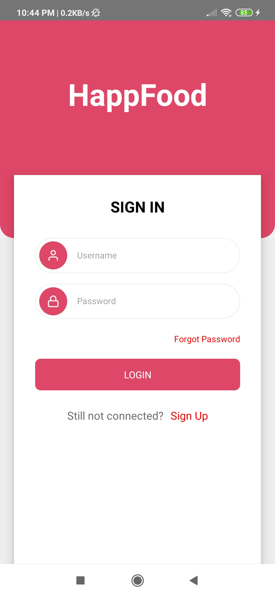
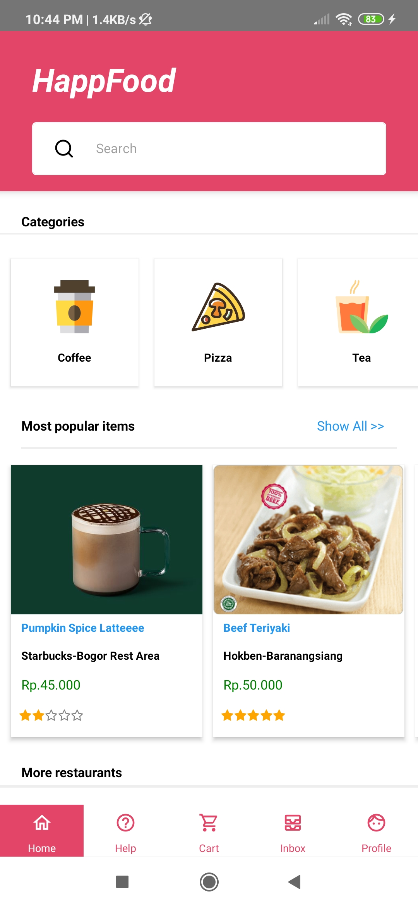
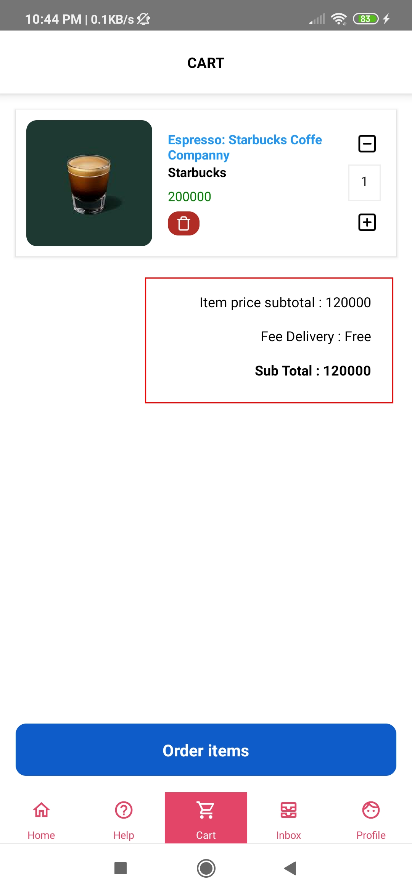
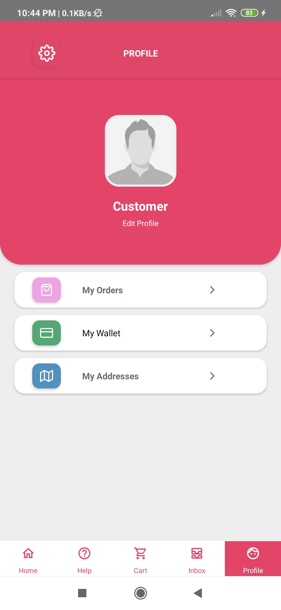
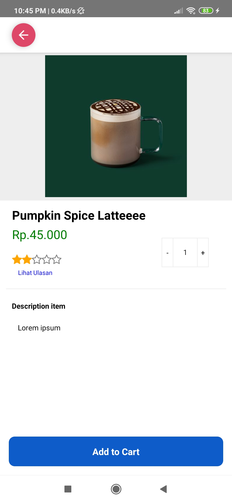

<h1 align="center">Happ Food - Online Food Delivery App</h1>

HappFood is an Online Food Delivery Mobile App built using React Native Framework and Integrated with HappFood-API as the Back-End.

## Screenshots

## Developing
1. Open your terminal or command prompt
2. Type `git clone https://github.com/amudia/fooddelivery-native.git`
3. Open the project directory and Type `yarn install` to install all dependencies
4. Type `yarn start` in the terminal or command prompt to run the App